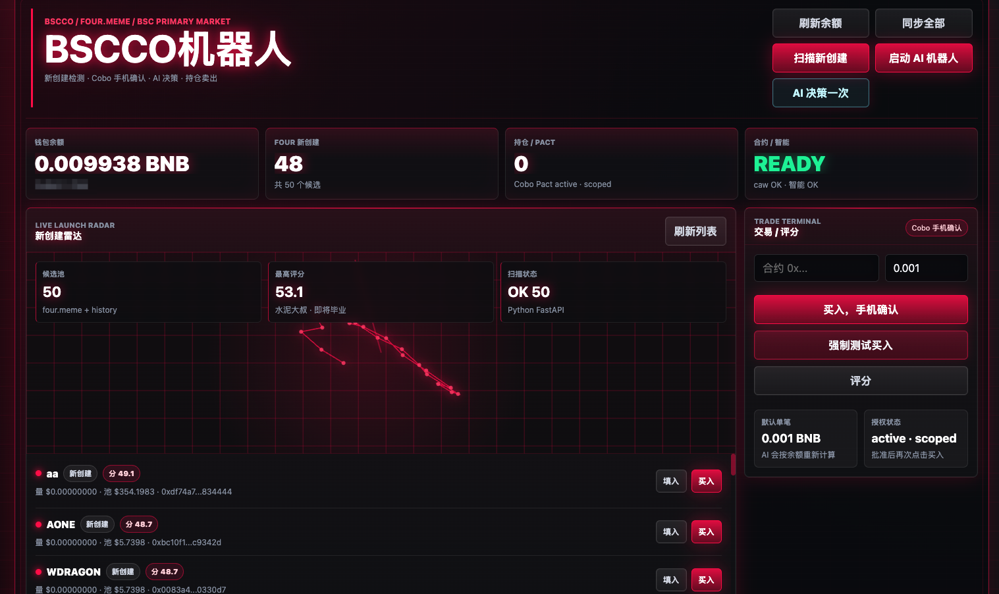
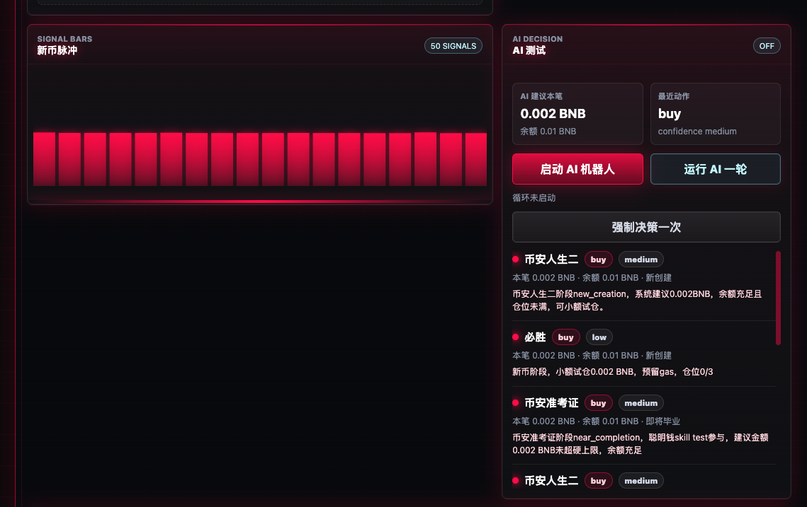
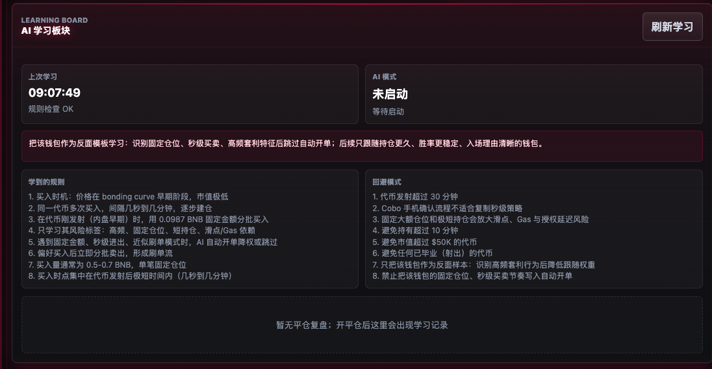
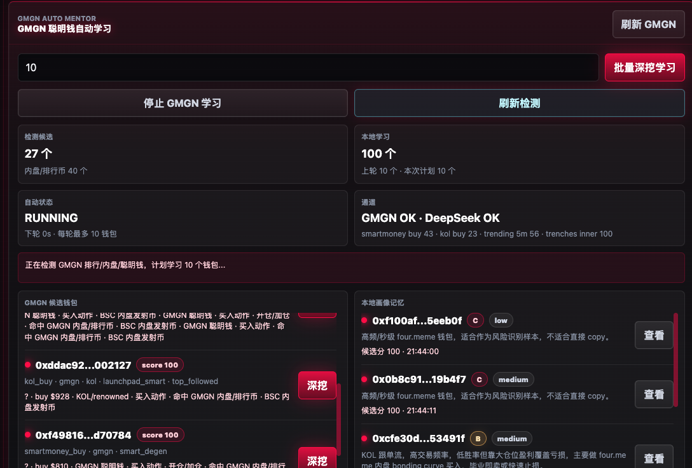
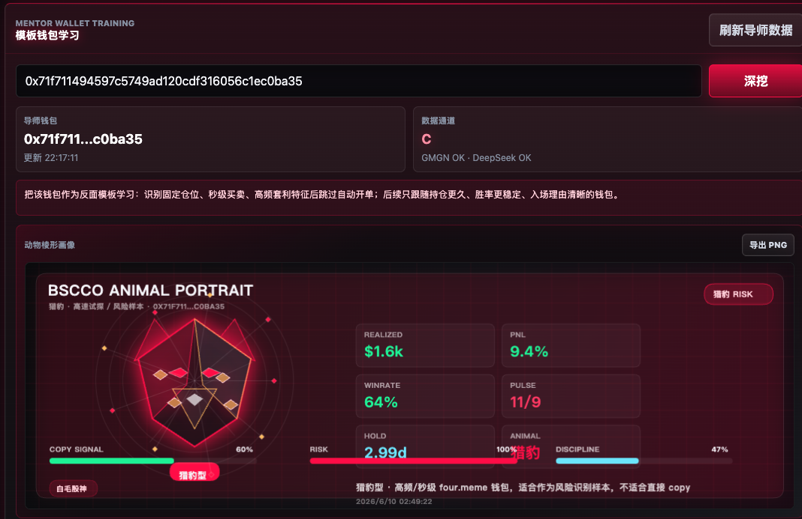
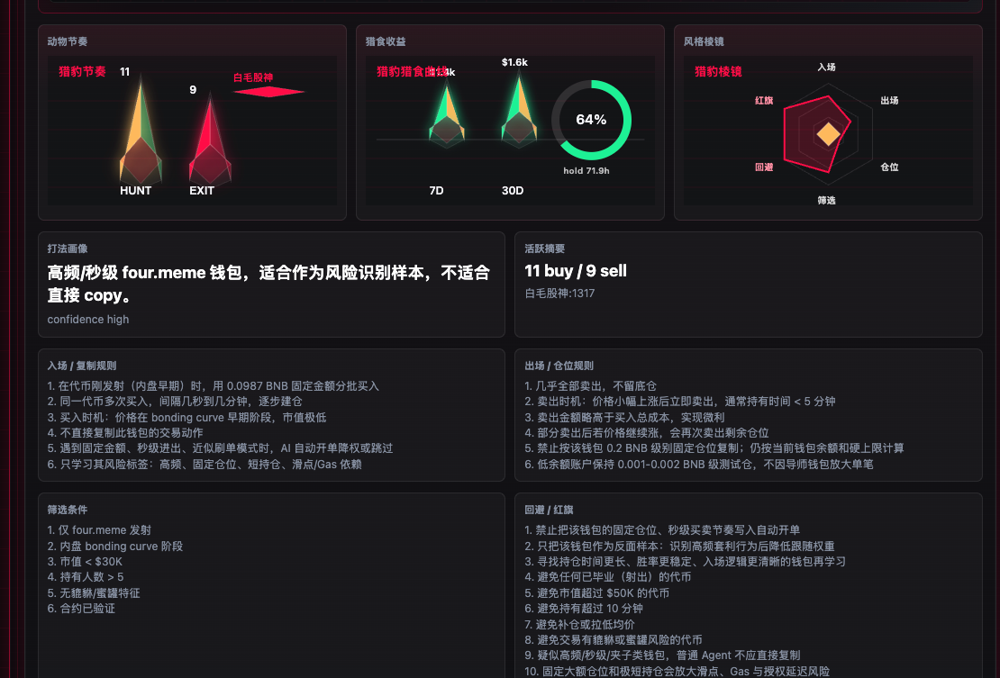

# BSCCO 机器人

昵称：**bscco**

**bscco** 是一个可升级、可持续学习的链上量化机器人，主要战场在 **BNB Smart Chain**。它通过 GMGN skill 分析链上数据、聪明钱轨迹、内盘新币和钱包交易行为，再把这些数据转成 AI 可执行的风控规则、仓位策略和交易决策。

它不是单纯的扫链脚本，而是一套能持续沉淀交易经验的 AI 交易台：发现新币、深挖钱包、学习画像、生成策略、发起交易、手机确认、持仓复盘，最后再把结果写回本地学习记忆。

> 风险提示：本项目用于 Demo、研究和比赛展示，不构成投资建议。真实交易前请使用小额资金、人工确认和独立风控。

## 产品定位

bscco 的目标是成为 BSC 链上的“可学习量化 Agent”：

- **主战场在 BSC**：围绕 BNB Smart Chain、four.meme 一级市场、内盘发射和毕业阶段构建交易逻辑。
- **链上数据驱动**：借助 GMGN skill 拉取 smart money、KOL、trending、trenches、wallet portfolio 等链上数据。
- **钱包行为学习**：把聪明钱钱包拆成入场节奏、卖出纪律、持仓偏好、风险标签和可复制规则。
- **策略持续升级**：每次交易、复盘、深挖都会写入本地学习数据，后续 AI 决策会参考这些记忆。
- **安全交易闭环**：AI 可以发出交易意图，但 Cobo Pact 和手机确认负责最后执行，避免机器人直接裸奔。

## Demo 截图

第一张：主界面，展示余额、新创建候选、交易终端、Pact 状态和新币雷达。



第二张：启动 AI 机器人与强制测试决策，展示自动决策、手动触发和最近动作。



第三张：AI 学习板块，展示规则学习、回避规则和交易复盘沉淀。



第四张：GMGN 聪明钱自动学习，支持填写批量学习数量，从排行、内盘、聪明钱候选里批量深挖。



第五张：深挖聪明钱钱包，把单个候选钱包转成可读画像和交易风格。



第六张：学习数据转化，把钱包行为拆成入场、出场、风控、仓位和回避规则。



## 核心能力

- **BSC 一级市场雷达**：扫描 four.meme 新创建、即将毕业和已射出候选，聚焦早期流动性和发射窗口。
- **GMGN skill 链上分析**：组合 GMGN trenches、smart money、KOL、trending、portfolio 等数据源，形成候选币和候选钱包池。
- **聪明钱批量深挖**：从 GMGN 排行、内盘、聪明钱流里提取钱包，按数量批量学习，写入本地画像记忆。
- **持续学习引擎**：把开单、平仓、胜负、跳过原因和钱包画像沉淀成规则，下一轮 AI 决策会继续引用。
- **AI 决策测试**：提供强制测试按钮，可以让 AI 对当前候选立即做一次 buy/skip/sell 决策，便于现场演示。
- **钱包交易执行**：通过 Cobo Agentic Wallet / Pact 发起链上交易，手机 App 人工确认，减少私钥暴露和无人值守风险。
- **余额驱动仓位**：默认单笔金额由当前 BNB 余额、预留余额、最大持仓数和上下限共同计算。
- **持仓和平仓管理**：持仓区支持手动卖出/清仓，成交后同步本地持仓、余额和复盘记录。
- **数据画像图表**：把导师钱包或 GMGN 候选钱包转成动物系棱形画像，展示分级、胜率、收益、节奏和风险标签。
- **TG 播报**：可通过 Telegram 推送开单、平仓、信号、余额和日终复盘。

## 为什么有优势

1. **从链上数据到钱包交易闭环**：GMGN 负责发现与分析，AI 负责提炼规则，钱包负责真实交易确认。
2. **可持续学习**：不是一次性打分，而是把聪明钱画像、交易复盘和风控规则沉淀成本地记忆。
3. **可升级策略内核**：ZAI/DeepSeek、GMGN 数据源、Cobo 钱包执行和前端控制台都可以独立替换或扩展。
4. **AI 不直接接触私钥**：交易由 Cobo Agentic Wallet / Pact 执行，手机确认是最后一道门。
5. **适合比赛演示**：打开网页即可看到发现、学习、决策、交易、持仓、复盘，不需要临场解释一堆脚本。
6. **轻量 Python 后端**：核心 Demo 用 FastAPI 单页运行，避免笨重前端链路影响提交展示。
7. **隐私可控**：`.env`、运行数据、钱包状态、持仓、日志默认不提交，只提交代码、示例配置和截图。

## 需要什么

- Python 3.10+
- BNB Smart Chain 钱包或 Cobo Agentic Wallet
- Cobo App，用于 Pact 授权和每笔交易手机确认
- `gmgn-cli` 与 `GMGN_API_KEY`，用于拉取 GMGN 市场和聪明钱数据
- ZAI API Key，默认用于 AI 决策和画像提炼
- DeepSeek API Key，可选，用于另一套比赛或备用模型
- Telegram Bot，可选，用于开单/平仓/信号播报
- BSC RPC，可用默认公开 RPC，也可以换成自己的稳定 RPC

## 快速启动

```bash
cd /Users/seche/Desktop/vscode/zai
cp .env.example .env
```

在 `.env` 里填写需要的 key 后启动 Demo 面板：

```bash
./start.sh
```

打开：

```text
http://localhost:8888
```

默认 `./start.sh` 只启动最快的 Web/API Demo。要启动完整机器人循环：

```bash
FULL_BOT=1 AI_AUTO_TRADE=true ./start.sh
```

## AI Provider

默认走 ZAI：

```env
AI_PROVIDER=zai
ZAI_API_KEY=your_zai_api_key
ZAI_BASE_URL=https://api.z.ai/api/paas/v4/
ZAI_MODEL=glm-5.1
```

切 DeepSeek：

```env
AI_PROVIDER=deepseek
DEEPSEEK_API_KEY=your_deepseek_api_key
DEEPSEEK_MODEL=deepseek-chat
```

## 关键环境变量

```env
TELEGRAM_BOT_TOKEN=
TELEGRAM_CHAT_ID=
TELEGRAM_NOTIFY_CHAT_ID=

AI_PROVIDER=zai
ZAI_API_KEY=
DEEPSEEK_API_KEY=

COBO_API_KEY=
COBO_WALLET_ID=
BSC_RPC_URL=https://bsc-dataseed.binance.org
WALLET_ADDRESS=

GMGN_API_KEY=
GMGN_PULL_INTERVAL=300

AI_AUTO_TRADE=true
AI_MAX_POSITIONS=3
AI_RESERVE_BNB=0.002
AI_TRADE_BALANCE_PCT=0.25
AI_MIN_BUY_BNB=0.001
AI_MAX_BUY_BNB=0.05
```

## 安全说明

- 不要把 `.env`、私钥、API key、钱包 ID、真实持仓数据上传到 GitHub。
- `.gitignore` 已忽略 `.env`、`.env.*`、`data/*.json`、日志、缓存和前端构建产物。
- Cobo Pact 用 scoped 授权，交易需要手机 App 人工确认。
- AI 自动交易适合小额 Demo，真实运行请设置余额预留、单笔上限和最大持仓。
- 如果 token 或密钥曾经发到聊天、群或截图里，请立即 revoke/rotate。

## 结构

```text
main.py                完整机器人入口
start.sh               Demo 快速启动脚本
web/server.py          FastAPI API 与页面服务
web/templates/index.html
plugins/ai_trader.py   AI 决策和余额驱动仓位
plugins/gmgn_learning.py
plugins/mentor_wallet.py
plugins/trading.py     Cobo / four.meme 买卖执行
plugins/wallet_balance.py
data/*.example.json    可提交示例数据；真实运行数据默认忽略
```
